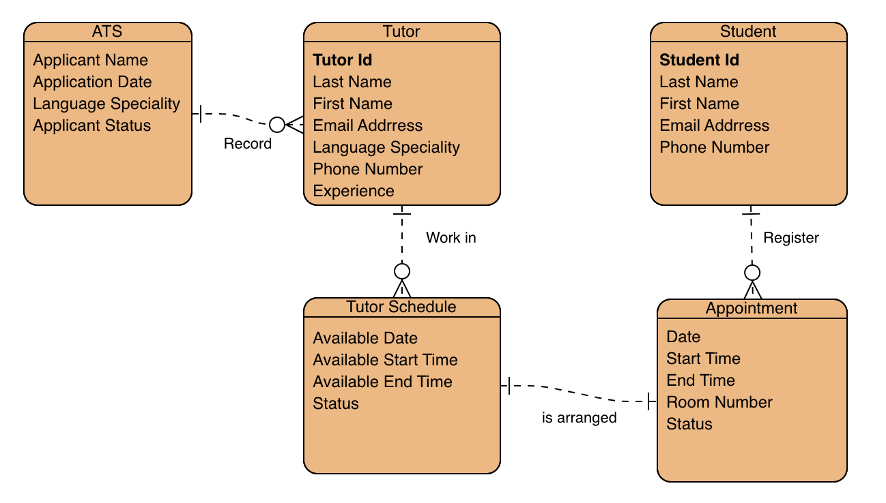

# Language Learning Center – Business Process Modeling 🏫

## 📊 Project Overview
This project models and optimizes the key workflows of a **Language Learning Center**, focusing on how students, tutors, and departments interact.  
It combines **BPMN 2.0** for process visualization and **ERD modeling** for database structure design — demonstrating full business logic and system integration.

---

## 🖼️ Diagram Overview

**BPMN Processes**
- Class Booking — proposal, scheduling, and tuition payment  
- Student Registration — new student onboarding  
- Tutor Application — recruitment and eligibility review  

📄 [View all BPMN diagrams (PDF)](./BPMN_All_Processes.pdf)

**ERD (Entity Relationship Diagram)**  
Preview of the database model showing relationships among students, tutors, and appointments:

  

*(Click to view the full-size version.)*

---

## 📂 Files in this Folder

| File | Description |
|------|--------------|
| [`Project_Report.pdf`](./Project_Report.pdf) | Detailed report describing workflows and data design |
| [`BPMN_All_Processes.pdf`](./BPMN_All_Processes.pdf) | Combined BPMN diagrams for all major processes |
| [`ERD_LanguageCenter.png`](./ERD_LanguageCenter.png) | Entity Relationship Diagram preview |

---

## 🔍 Key Insights

- Integrated booking and payment confirmation reduced manual coordination  
- Standardized tutor scheduling via one-to-many relationships  
- Enhanced cross-department communication (HR, Finance, and Customer Service)  
- Improved transparency and efficiency in workflow documentation  

---

## 🛠 Tools Used

- **bpmn.io (Camunda)** — Designed and exported BPMN 2.0 process diagrams  
- **Visual Paradigm Online** — Created and visualized the Entity Relationship Diagram (ERD)
 
  

