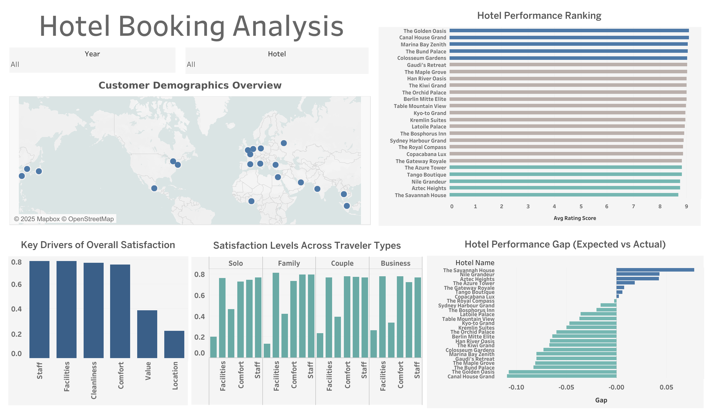

# Hotel_Booking_Analysis 🏨

## 📊 Project Overview  
This project provides a full end-to-end analysis of hotel booking satisfaction using **Python (descriptive statistics, missing & duplicate checks), SQL (data aggregation & KPI analysis), and Tableau (interactive visualization)** to support data-informed hospitality strategies.

---

## 🖼️ Dashboard Preview  

🌐 [View Interactive Dashboard on Tableau Public](https://public.tableau.com/app/profile/vincent.chien/viz/HotelBookingAnalysis_17613968529020/Dashboard1)  

---

## 📂 Files in this folder

- 📊 [Business Report (PDF)](./Hotel_booking_analysis.pdf)  
  → Business report summarizing analysis and insights  
- 🖼️ [Dashboard Preview](./Hotel_booking_dashboard.png)  
  → Tableau dashboard snapshot  
- 🐍 [Python Notebook](./hotel_booking.ipynb)  
  → Data cleaning, missing value handling, duplicate checks, and descriptive statistics  
- 🧮 [SQL Queries](./hotel_booking.sql)  
  → SQL queries for aggregation and analysis  

---

## 🔍 Key Insights  
- **Top vs Bottom Hotel Performance** → High-performing hotels serve as benchmarks, while low-performing ones may require improvement in overall guest satisfaction.  
- **Rated Dimensions** → Guests place greater value on experience-driven factors (comfort, facilities, staff engagement) over cost or location convenience.  
- **Visitor Demographics** → The majority of guests are from the US and UK, with the 25–34 age group forming the dominant segment, followed by 35–44.  
- **Traveler Type Preferences** → Solo travelers prioritize staff interaction; couples value comfort; family and business travelers focus on facilities.  
- **Expectation vs Reality** → Underperforming hotels compared to baseline expectations indicate refinement opportunities, while outperformers can be used as reference models.  

---

## 🛠 Tools Used  

- **Python (Pandas)** → EDA: data loading, missing & duplicate checks, summary statistics  
- **SQL** → Dataset restructuring, joins, view creation, analytical aggregation  
- **Tableau** → Dashboard for hotel rankings, customer patterns, and satisfaction insights  

---

## 📈 Data Source  
<a href="https://www.kaggle.com/datasets/alperenmyung/international-hotel-booking-analytics" target="_blank">International Hotel Booking Analytics Dataset (Kaggle)</a>  

