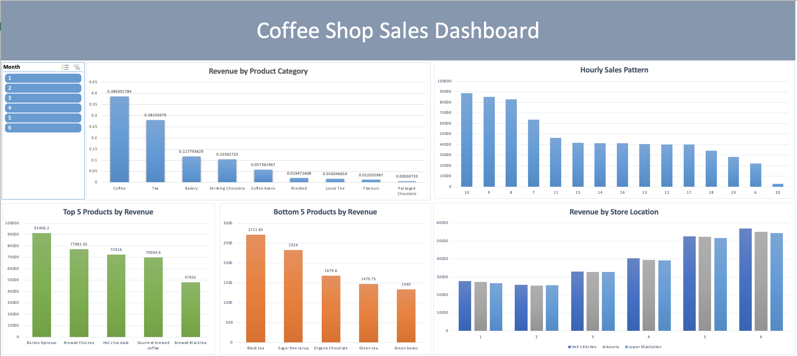

# Coffee Shop Sales Analysis ☕

## 📊 Project Overview
This project analyzes coffee shop sales data to identify revenue drivers, customer buying patterns, and store performance.  
It includes both **business insights** and an interactive **Excel dashboard**.

## 🖼️ Dashboard Preview

## 📂 Files in this folder
- `CoffeeShopSales_Analysis.pdf` → Business analysis report with insights & recommendations  
- `CoffeeShop_Sales_Dashboard.xlsx` → Interactive Excel dashboard (with hidden data tables)  
- `Dashboard.png` → Preview image of the dashboard  

## 🔍 Key Insights
- Coffee & Tea generate ~67% of revenue → core categories for promotion  
- Morning (8–10 AM) is the peak sales period → ideal for targeted offers  
- Hell’s Kitchen store slightly leads others → replicate winning strategies  

## 🛠 Tools Used
- Excel (PivotTables, Slicers, Dashboard design)  
- PowerPoint (Business report presentation)
