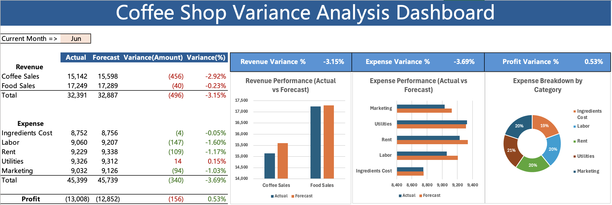

# ☕ Roast Coffee Shop Financial Variance Analysis

## 📊 Project Overview

This project analyzes the monthly financial performance of a roast coffee shop using **variance analysis** to compare Actual vs. Forecasted results. The goal is to identify key drivers behind changes in revenue, operating expenses, and overall profitability. 

The analysis focuses on:
- **Sales performance** by product category (Coffee vs. Food)
- **Operating expenses** including Ingredients, Labor, Rent, Utilities, and Marketing
- **Monthly profit variance**
- **Key cost and revenue factors** influencing financial outcomes

A visual dashboard was developed to clearly highlight performance trends and support data-driven business decision-making.

---

## 📈 Dashboard Preview

## 📈 Dashboard Preview

---

## 🔍 Key Insights

- Revenue declined (**-3.15%**) mainly due to weak Coffee sales  
- Expenses decreased (**-3.69%**) → strong cost control, especially in Labor, Rent, and Marketing  
- Focus should shift to **boosting revenue (especially coffee)** rather than further cost cutting

---

## 🗂️ Files in This Folder
- 📊 [Coffee_Shop_Financial_Variance_Analysis (Excel)](./Coffee_Shop_Financial_Variance_Analysis.xlsx)  
  → Raw financial data with Actual vs. Forecast values and variance calculations  

- 📈 [Variance Dashboard (Png)](./Roast_Coffee_Shop_Variance_Analysis_dashboard.xlsx)  
  → Completed Excel dashboard visualization (Revenue, Expense & Profit Variance Charts)  

---

## 🛠 Tools Used

- **Microsoft Excel**
  - Pivot Tables
  - Charts (Bar, Donut)
  - Conditional Formatting
  - Variance Formulas

---

## 📈 Data Source
<a href="https://www.kaggle.com/datasets/alejandromendozaarv/roast-coffee-shop-2023-financials/data" target="_blank">Roast Coffee Shop – 2023 Financials (Kaggle)</a>

