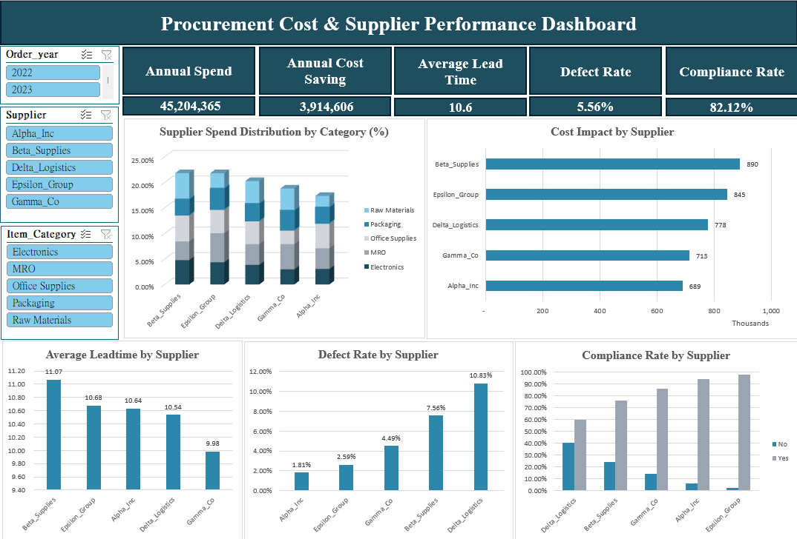

# 📦 Procurement Cost & Supplier Performance Analysis  
*A comprehensive procurement analytics project covering spend analysis, cost savings, and supplier performance evaluation.*

---

## 📌 Project Overview

This project analyzes procurement operations across multiple suppliers to identify cost drivers, evaluate negotiation effectiveness, and assess supplier performance.

Based on **700+ purchase orders (2022–2023)**, the analysis addresses challenges such as rising costs, supplier delays, and inconsistent quality to support better decision-making.

The analysis covers:

- Spend analysis by supplier and category  
- Cost savings (Unit Price vs. Negotiated Price)  
- Supplier performance (lead time, defect rate, compliance)  
- Procurement efficiency and cost structure insights  

**Excel analytics • cost optimization • supplier evaluation • business insights • dashboard design**

---

## 📊 Dashboard Preview

---

## 📂 Files in this folder

- 📊 [Financial Model / Dataset (Excel)](./Procurement_KPI_Analysis.xlsx)  
  → Procurement dataset including spend, pricing, quantity, and supplier metrics  

- 📈 [Dashboard Snapshot](./Procurement_Cost_Optimization_dashboard.png)  
  → KPI dashboard summarizing cost, performance, and supplier insights  

- 📑 [Project Summary (PDF)](./Procurement_Cost_Optimization.pdf)  
  → Full presentation including business context, analysis, and recommendations  

---

## 🔍 Key Insights

- **Supplier spend is well-balanced** → reduces concentration risk but limits negotiation leverage  
- **Production-related categories (Raw Materials, Packaging, Electronics) drive costs**  
- **Alpha Inc shows strong negotiation but low overall impact**  
- **Beta & Epsilon contribute highest cost impact → negotiation opportunity**  
- **Delta Logistics has highest defect rate + low compliance → major risk**  
- **Gamma Co has best lead time performance → most reliable supplier**  

---

## 🛠 Tools Used

**Excel:** Pivot Tables • KPI Dashboard • Cost Calculations  
**Analysis:** Spend Analysis • Cost Optimization • Supplier Cost Evaluation 

---

## 📊 Data Source

[Procurement KPI Analysis Dataset (Kaggle)](https://www.kaggle.com/datasets/shahriarkabir/procurement-kpi-analysis-dataset)
